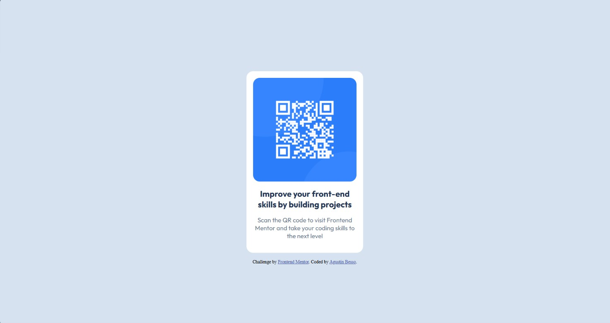

# Frontend Mentor - QR code component solution

This is a solution to the [QR code component challenge on Frontend Mentor](https://www.frontendmentor.io/challenges/qr-code-component-iux_sIO_H). Frontend Mentor challenges help you improve your coding skills by building realistic projects. 

## Table of contents

- [Overview](#overview)
  - [Screenshot](#screenshot)
  - [Links](#links)
- [My process](#my-process)
  - [Built with](#built-with)
  - [What I learned](#what-i-learned)
  - [Continued development](#continued-development)
  - [Useful resources](#useful-resources)
  - [AI Collaboration](#ai-collaboration)
- [Author](#author)
- [Acknowledgments](#acknowledgments)

**Note: Delete this note and update the table of contents based on what sections you keep.**

## Overview

### Screenshot



### Links

- Solution URL: [Add solution URL here](https://your-solution-url.com)
- Live Site URL: [Add live site URL here](https://your-live-site-url.com)

## My process

### Built with

- Semantic HTML5 markup
- CSS custom properties
- Flexbox
- CSS Grid
- Mobile-first workflow

### What I learned

I learned the basics of how to make the webpage responsive to make it look visually appealing independently of the device.
I also made good use of the 'class' attribute inside `<div>` components for future styling using CSS:

```html
<div class="container">
    <div class="qrCode">
      
    </div>
    <div class="content">
      <h1>Improve your front-end skills by building projects</h1>
      <p>Scan the QR code to visit Frontend Mentor and take your coding skills to the next level</p>
    </div>
  </div>
```
It was also my first time using external fonts in development:

```html
<link href="https://fonts.googleapis.com/css2?family=Outfit:wght@100..900&display=swap" rel="stylesheet">
```
I consider the most valuable block of code in my CSS file to be this next one, since it represented the real challenge of positioning the container div in the middle of the page to imitate as close as possible the given image.

```css
.container {
      background-color: hsl(0, 0%, 100%);
      display: flex;
      flex-direction: column;
      align-items: center;
      justify-content: center;
      padding: 1rem;
      font-family: 'Outfit', sans-serif;
      text-align: center;
      margin: 1rem auto;
      max-width: 250px;
      border-radius: 1rem;
    }
```

### Continued development

In future projects I plan to continue my path to learning how responsiveness works, and add accessibility features to strengthen my foundations in front-end development. Also, I plan to acquire more knowledge in the fields of UX/UI and be able to build websites not only functional but user-friendly and accessible. 

### Useful resources

- [W3Schools](https://www.w3schools.com/) - Always the most reliable source for troubleshooting when I get stuck with some concept.

### AI Collaboration

Given the low complexity of the present project, the use of AI agents was truly limited. In this case, I used Claude when I felt I had already tried everything and wasn't getting to the desired solution, particularly on the Flexbox features and importing the 'Outfit' font from Google Fonts, which are actions I never used before. 

## Author

- Website - [Agustín Besso](https://www.your-site.com)
- Frontend Mentor - [@yourusername](https://www.frontendmentor.io/profile/yourusername)

**Note: Delete this note and add/remove/edit lines above based on what links you'd like to share.**

## Acknowledgments

This is where you can give a hat tip to anyone who helped you out on this project. Perhaps you worked in a team or got some inspiration from someone else's solution. This is the perfect place to give them some credit.

**Note: Delete this note and edit this section's content as necessary. If you completed this challenge by yourself, feel free to delete this section entirely.**
